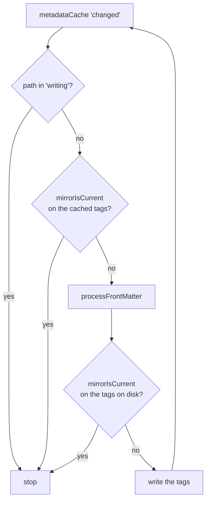

# Architecture

Loose Ends keeps one tag on a note in step with what the note's own tags say.
Everything else, the commands, the inbox block and the prompts, is built
around that.

## Layers

| Path | What it holds |
| --- | --- |
| `src/core/` | Every decision. Pure: no Obsidian imports except type-only ones, no filesystem. Every file has a test named after it. |
| `src/commands/` | **Add note** and **File note**, wired to Obsidian. |
| `src/ui/` | The prompts and pickers, the inbox block, the note menu, the prompt drawing and the settings tab. |
| `src/mirror.ts` | Keeps the unfiled tag in step: one note, or every note in scope. |
| `src/inbox.ts` | The vault side of the inbox block, and the log of when notes were filed. |
| `src/templates.ts` | Reads the template folder. |
| `src/frontmatter.ts` | The one place `any` is allowed in. See below. |
| `src/context.ts` | `Context`: app, settings and `saveSettings`, which is all a command gets. |
| `src/main.ts` | Registers the commands, events, block and editor extension. |

### Core

| File | What it decides |
| --- | --- |
| `filing.ts` | What filed means, and what the unfiled tag should be. |
| `vocabulary.ts` | Axes and values, and the one place a value is read off a note's tags. |
| `tags.ts` | Reading the `tags` property in all its shapes, and writing an answer. |
| `inbox.ts` | What the inbox block lists, and the filing log. |
| `template.ts` | Filling a template in, dates in names, the cursor. |
| `prompts.ts` | Reading prompts from templates, taking them out of a new note, and where to draw them. |
| `recent.ts` | Ordering choices by what was picked last. |
| `note.ts` | Where a new note goes, and what's wrong with a name. |
| `settings.ts` | The settings shape, defaults and loading. |

**Every decision belongs in `core/`.** If something in `commands/` or `ui/` is
deciding rather than wiring, it is in the wrong file. A function there that
could be tested by passing it plain objects wants moving.

**Commands take a `Context`, never the plugin class.** Only the settings tab
needs the real `Plugin`.

## The write loop

The unfiled tag is written from a metadata listener, and writing it changes the
metadata. Without guards, the listener would see its own write, decide again,
and write again, forever. There are three:

1. **`writing` in `main.ts`**, a set of paths with a write in flight, so two
   changes in the same tick can't both open the same file.
2. **`mirrorIsCurrent` on the cached tags**, in `syncMirror`, so a note that is
   already right is never opened.
3. **`mirrorIsCurrent` again inside `processFrontMatter`**, against what is on
   disk, because the cache can be a moment behind.

After a write, the listener fires again, finds the tag current, and stops.

**Every write of the unfiled tag goes through `mirrorIsCurrent` first.** A new
code path that writes it without the check is the bug this section exists to
prevent.

## Scope

`inScope` in `mirror.ts` decides whether a note belongs to the plugin: it's in
the notes folder, or the notes folder is empty. The unfiled tag is only ever
written in scope, **File note** and **Set** only act in scope, the inbox block
only lists notes in scope, and prompts are only drawn in scope.

## `frontmatter.ts`

`processFrontMatter` hands its callback an `any`. It is narrowed once, in
`editFrontmatter` and `cachedTags`, so nothing else in the plugin reaches
through an untyped value. Read and write frontmatter through these two.

## The sweep

`sweepMirror` runs `syncMirror` over every note in scope. It runs:

- quietly on startup, once the metadata cache is ready,
- from **Refresh tags**, with a notice saying how many notes changed,
- when an axis is removed, and when the settings tab closes after the axes
  changed (`sweepIfAxesChanged`). Not on every keystroke while an axis is
  being typed.

## Prompts

Prompts are read from the templates into `main.ts` (`readPrompts`) whenever a
template is created, changed, renamed or deleted, because the editor extension
in `ui/ghost.ts` draws synchronously and can't wait for a file read. See
[Templates](templates.md).

## What is stored

- **Settings:** `data.json`, through `saveData`.
- **Local storage, per vault and device:** the order templates were last picked
  in (`loose-ends-recent-templates`), the same per axis
  (`loose-ends-recent-axis-<namespace>`), and when notes were filed
  (`loose-ends-filings`). Losing any of these costs an order or the Recently
  filed section, never an answer.
